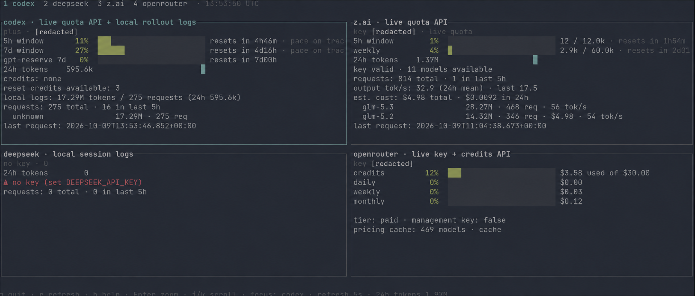

# aitop

**`htop` for AI usage.** A live terminal dashboard for quotas, reset timers, balances, and local token throughput—one Rust binary, with plain-text and JSON output for scripts.

[](https://github.com/rafaelzimmermann/aitop/actions/workflows/ci.yml)

- Track Codex, Claude, Copilot, z.ai, OpenRouter, and DeepSeek in one place.
- Inspect Strata and Ollama engine state alongside local session activity.
- See rolling quota windows, reset countdowns, spending budgets, and usage pace.
- Zoom into a provider or use the two-column overview on terminals at least 110 columns wide.
- Distinguish live provider data, local estimates, and stale cached snapshots in panel titles.



*Dashboard screenshot edited to redact account email and key fragments.*

## Install

Build from source with a current stable [Rust toolchain](https://www.rust-lang.org/tools/install) and Git:

```bash
git clone https://github.com/rafaelzimmermann/aitop.git
cd aitop
cargo install --path . --locked
aitop
```

Alternatively, the Bash installer builds a release binary into `~/.local/bin` and seeds `~/.config/aitop/.env` from your project `.env`, or from `.env.example` when no project config exists:

```bash
./install.sh
./install.sh --run                # install and print a snapshot
./install.sh --prefix /usr/local  # choose an installation prefix
./install.sh --no-config          # skip config creation
./install.sh --uninstall          # remove the installed binary
```

The installer uses `readlink -f`; on systems without it, use `cargo install` above. Ensure the chosen binary directory is on your `PATH`.

## Quick start

Existing Codex and Claude credentials and GitHub CLI authentication are discovered automatically. For API keys and provider selection, copy the configuration template and edit it locally:

```bash
mkdir -p ~/.config/aitop
cp .env.example ~/.config/aitop/.env  # first-time setup; preserve an existing config
chmod 600 ~/.config/aitop/.env
```

When `PROVIDERS` is unset, aitop auto-detects the services configured on your machine
(keys/auth files present, a local strata/ollama engine listening on loopback, or an
OpenClaw state directory / gateway port present) and shows only those panels, falling
back to `codex` if nothing is configured. Choose your own order:

```bash
PROVIDERS=codex,claude,copilot,z.ai,openrouter,deepseek aitop
PROVIDERS=strata,ollama aitop
```

```bash
aitop                         # interactive dashboard
aitop --plain                 # one text snapshot
aitop --json --redact          # JSON with account email and key prefixes hidden
aitop --plain --watch 30       # refresh every 30 seconds
aitop --plain --history        # seven daily sparkline buckets instead of 24 hourly ones
aitop --help
```

`--plain` and `--json` exit after one snapshot unless `--watch N` is supplied. Watched JSON output is a sequence of pretty-printed JSON objects.

### Keyboard controls

| Key | Action |
| --- | --- |
| `q` / `Ctrl-C` | Quit |
| `r` | Request a refresh |
| `h` | Toggle help |
| `Tab` / `Shift-Tab` | Next / previous provider |
| `1`–`9` | Focus a provider |
| `Enter` | Toggle focused-panel zoom |
| `j` / `k` or `↓` / `↑` | Cycle providers; scroll details when zoomed |
| `Esc` | Leave zoom, or quit from the overview |

## Providers and data sources

| Provider | Live data | Credentials / local data |
| --- | --- | --- |
| **Codex** | Quota windows from `/backend-api/codex/usage` | `~/.codex/auth.json` or `CODEX_ACCESS_TOKEN`; rollout logs under `~/.codex/sessions` |
| **Claude** | OAuth usage from `/api/oauth/usage` | Claude Code OAuth credentials in `~/.claude/.credentials.json`; ordinary `sk-` API keys do not authenticate this endpoint; local pi logs provide fallback activity |
| **Copilot** | Quota information from `/copilot_internal/user` | `GITHUB_TOKEN`, `GH_TOKEN`, or the token in `~/.config/gh/hosts.yml` |
| **z.ai** | Quota windows from `/api/monitor/usage/quota/limit`; rate-limit header probe | `ZAI_API_KEY`; falls back to local pi usage against configured `ZAI_LIMIT_*` caps |
| **OpenRouter** | Key usage and credits from `/api/v1/key` and `/api/v1/credits` | `OPENROUTER_API_KEY`; optional spending budgets |
| **DeepSeek** | Account balance from `/user/balance` | `DEEPSEEK_API_KEY`; local pi activity alongside the lifetime balance |
| **Strata** | Engine status, model, context, and queue from `/status` and `/v1/models` | `STRATA_BASE_URL` (default `http://127.0.0.1:8081`); local pi activity |
| **Ollama** | Loaded models and VRAM from `/api/ps` | `OLLAMA_BASE_URL` (default `http://127.0.0.1:11434`); local pi activity |
| **OpenClaw** | Gateway state plus active agent sessions (context window per session) | `OPENCLAW_DIR` (default `~/.openclaw`) and `OPENCLAW_PORT` (default `18789`); session rows read from each agent's `openclaw-agent.sqlite` |
| **Other names** | Local session accounting | Matching provider entries under `PI_SESSION_DIR`; totals and throughput without artificial quota bars |

Provider endpoints can change or reject credentials. Check each panel's source and error information: local estimates and cached snapshots do not prove that a server quota is available. Each HTTP request has a 10-second timeout; providers are fetched concurrently.

### Understanding the numbers

- **Live quotas vs. estimates:** z.ai uses server-reported quota rows when available. Its fallback bars compare locally recorded tokens with your assumed caps. An “over assumed cap” label may mean the configured cap is wrong.
- **Coverage:** local accounting only includes recorded sessions. Activity through other clients is invisible unless it appears in those logs.
- **Throughput:** pi output tokens are divided by the parent-to-assistant timestamp gap, excluding intervening tool execution. These timestamps do not isolate model decoding from prefill or other request overhead.
- **Pricing:** local cost estimates use OpenRouter model pricing, cached in `~/.cache/aitop/pricing.json` for 24 hours by default. Estimates are not invoices.
- **Pace:** where a window start is known, usage is compared with elapsed time. At 20% usage halfway through a window, `pace ahead 30%` means usage is below the elapsed share. `PACE_TRIGGER` controls the threshold.
- **Balances:** DeepSeek balance and OpenRouter credits are lifetime account balances, not rolling quotas. OpenRouter calendar pace uses configured budgets.
- **Cap changes:** observed caps persist in `limits.json`; a change is reported on the next run. JSON rows also expose `cap`.

## Configuration

Existing environment variables take precedence over dotenv values. File selection is: `AITOP_ENV` when set; otherwise `.env` in the current directory or a parent; then `~/.config/aitop/.env`; finally the source directory's `.env` in debug builds only.

See [`.env.example`](.env.example) for a starting configuration. Use absolute paths or `${HOME}` in dotenv path values; literal `~` is not expanded by the application.

| Variable | Purpose / default |
| --- | --- |
| `PROVIDERS` | Panel order; when unset, auto-detects configured/active services (fallback `codex`) |
| `REFRESH_SECONDS` | Dashboard refresh interval; `5` |
| `AITOP_REDACT` | Hide account email and key prefixes; `1` enables |
| `AITOP_HISTORY` | Use seven daily sparkline buckets; `1` enables |
| `CODEX_AUTH_FILE` / `CODEX_ACCESS_TOKEN` | Override Codex credential file or access token |
| `CODEX_BASE_URL` | `https://chatgpt.com/backend-api` |
| `CODEX_INSTALLATION_ID` | Override ID normally read from `~/.codex/installation_id` |
| `CLAUDE_CREDENTIALS_FILE` | Override Claude Code OAuth credential file |
| `ANTHROPIC_BASE_URL` | `https://api.anthropic.com` |
| `GITHUB_TOKEN` / `GH_TOKEN` | Copilot authentication |
| `GITHUB_API_BASE_URL` | `https://api.github.com` |
| `ZAI_API_KEY` / `ZAI_BASE_URL` | Key and base; `https://api.z.ai/api/coding/paas/v4` |
| `ZAI_LIMIT_5H` / `DAY` / `WEEK` / `MONTH` / `RPM` | Local fallback caps (each uses the `ZAI_LIMIT_` prefix); defaults `200000` / `1000000` / `5000000` / `0` / `30` |
| `OPENROUTER_API_KEY` / `OPENROUTER_BASE_URL` | Key and base; `https://openrouter.ai/api/v1` |
| `OR_BUDGET_DAY` / `OR_BUDGET_WEEK` / `OR_BUDGET_MONTH` | Optional whole-dollar spending budgets |
| `DEEPSEEK_API_KEY` / `DEEPSEEK_BASE_URL` | Key and base; `https://api.deepseek.com` |
| `STRATA_BASE_URL` / `OLLAMA_BASE_URL` | Local engine addresses; see provider table |
| `OPENCLAW_DIR` / `OPENCLAW_PORT` | OpenClaw state directory and gateway port; `~/.openclaw` / `18789` |
| `CODEX_SESSION_DIR` / `PI_SESSION_DIR` | Log roots; `~/.codex/sessions` / `~/.pi/agent/sessions` |
| `AITOP_CACHE_DIR` | Cache location; `~/.cache/aitop` |
| `PRICING_CACHE_HOURS` | Pricing cache lifetime; `24` |
| `PACE_TRIGGER` | Pace threshold in percentage points; `10` |

## Privacy

Keep API keys in environment variables or an untracked `.env` file. The dashboard normally displays account email and a four-character key prefix; use `--redact` or `AITOP_REDACT=1` before sharing output. Review diagnostics and local paths before posting logs.

Cache directories and files use owner-only permissions on POSIX systems (`0700` / `0600`). Cache content can include account information and refreshed credentials; do not commit it. The local pre-commit hook is not installed by cloning the repository.

## Development

The implementation uses Ratatui, crossterm, synchronous `ureq` requests, and standard-library threads. Panel builders are separated from networking so unit tests use static fixtures.

```bash
cargo test
cargo clippy --all-targets -- --deny warnings
cargo fmt --check
cargo build --locked
./target/debug/aitop --render-test
./target/debug/aitop --render-test --synthetic --size 120x30
./target/debug/aitop --render-test --synthetic --size 100x30
./target/debug/aitop --plain
```

The live render and plain snapshot commands use your configured credentials and endpoints. See [AGENTS.md](AGENTS.md) for architecture and contribution conventions.
